# 🛠️ Mopo Hands-On Tutorial

Welcome aboard! This tutorial will guide you through building an **expansion planning model** to identify critical infrastructure investments and support the transition of the industrial sector to **climate neutrality by 2050**. 

The model optimizes investment decisions for three key milestone years—2030, 2040, and 2050—using 2025 as the baseline. Each milestone is solved sequentially in a rolling horizon approach: the infrastructure investments made in one milestone year are carried forward as inputs to the next, ensuring continuity and realism in long-term planning.

---

## 🔧 Spine Tools Installation

To run this tutorial, you need to install the Spine Tools. For a streamlined setup, use the provided installation script. There are 2 scripts: one for spine tools and one for ines tools. It is important to run the spine tools installation script first. You can run this script using **Git for Windows** or any compatible terminal.

More information on the spine tools script can be found [here](https://github.com/spine-tools/spine-installation-tools/blob/main/readme.md) (though the version we use here is slightly modified)

### ✅ Requirements
- **Python** ≥ 3.9  
- **Julia** ≥ 1.8

Reminder: Make sure that all tools are configured to point to the correct executables, and ensure the SpineOpt plugin is added to your environment.

---

## 🔄 Data Pipelines

Data pipelines are used to import external datasets into the Spine project, ensuring the data is standardized and ready for downstream modeling.

We will use the following three Spine items to build our data pipelines:

1. **Data Connector**: This tool locates the raw data that we will import (shown on the left in the image).
2. **Python Tool**: This tool processes the raw data (shown in the middle of the image) and fills a Spine database in SQLite with a predefined standard format.
3. **SQLite Database**: This database will contain the processed raw data in a more accessible format (shown on the right in the image).


This tutorial includes four main pipelines:

### 1. Industrial Sector 🏭
This pipeline contains data on major industrial sectors in Europe, including:
- Energy demand
- Capital costs
- Operational costs
- Conversion efficiency ratios

### 2. Biomass 🌱
This dataset provides:
- Technical potential limits for biomass use across Europe
- Operational costs of biomass production

### 3. Gas 💨
This pipeline imports data on technologies for:
- Production
- Storage
- Transmission

...of energy vectors such as **methane**, **hydrogen**, and **carbon dioxide**. In this case study, the model includes **Direct Air Capture (DAC)** technology, which produces CO₂. This is essential to meet climate constraints, especially since other sectors that could supply CO₂ are not modeled.

### 4. Commodity 💲
This is Spine database that includes expected energy carrier prices and the CO₂ content of each commodity.

---

## 🎥 Data Pipelines Creation

### 1. Industrial Sector 🏭

* Data Source: Specify the path to the input file [industry_data.xlsx](spinefiles/industrypipelinedemo/raw_data/industry_data.xlsx) using the Data Connector.
* Processing Script: Use the script [industry_DB.py](spinefiles/industrypipelinedemo/pipelines/_industry-aidres/industry_DB.py) to process the data.
* Tool configuration:
    * Define the argument order in the tool properties.

    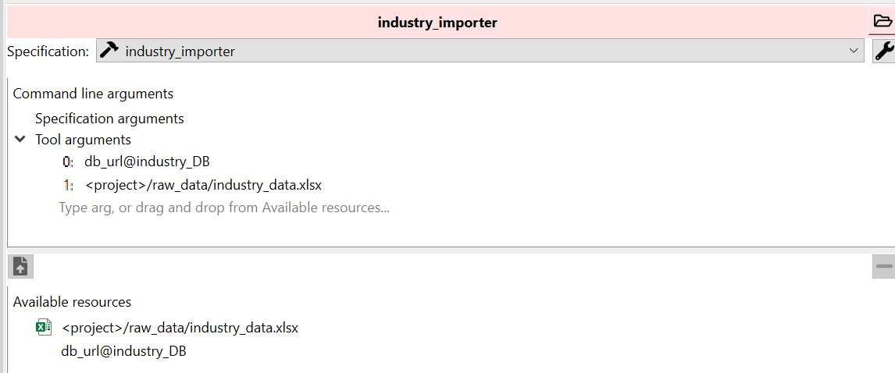

    * Set the source directory in the tool properties.

    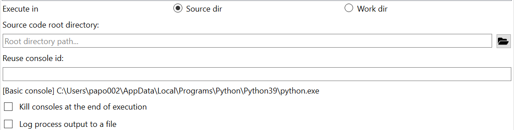

* In the connection properties, enable all purge options to ensure the database is cleared before each execution.

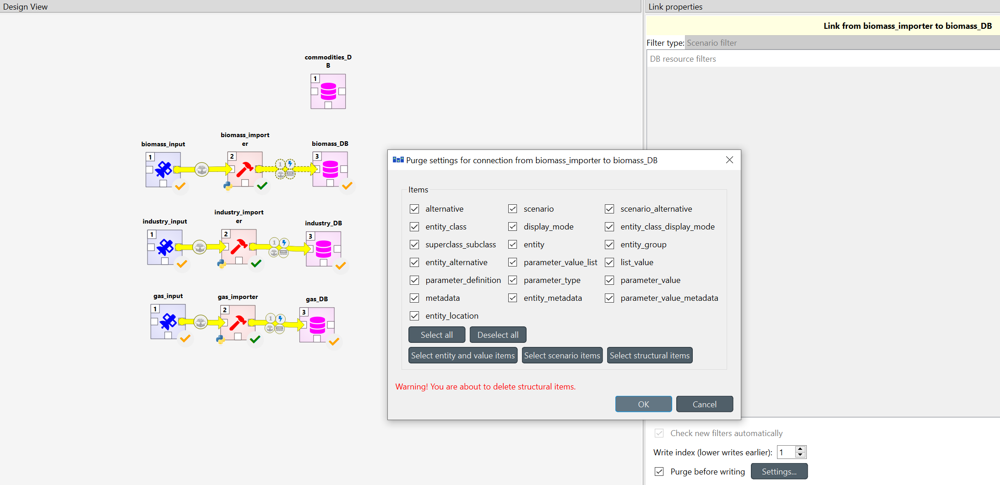

* Execution: Run the tool to populate the Spine database with processed industrial sector data.

### 2. Biomass 🌱
* Data Source: [biomass_data.csv](spinefiles/industrypipelinedemo/raw_data/biomass_data.csv)
* Processing Script: [biomass_DB.py](spinefiles/industrypipelinedemo/pipelines/_biomass/biomass_DB.py)
* Tool Configuration:
    * Define the argument order in the tool properties.

    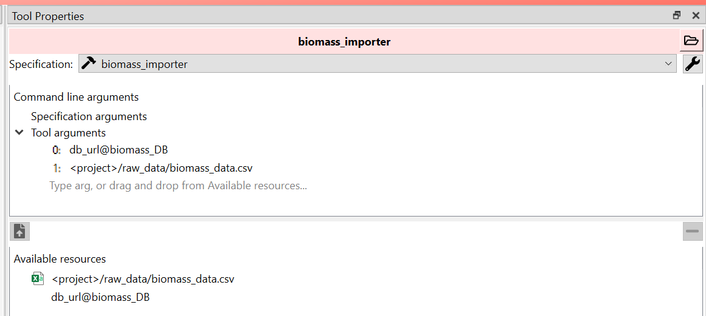

    * Set the source directory and enable full purge options in the connection properties, following the same procedure as the Industrial Sector pipeline.

### 3. Gas 💨
* Data Source: [gas_data.xlsx](spinefiles/industrypipelinedemo/raw_data/gas_data.xlsx) and [EU_historical_inflation_ECB.csv](spinefiles/industrypipelinedemo/raw_data/EU_historical_inflation_ECB.csv)
* Processing Script: [gas_DB.py](spinefiles/industrypipelinedemo/pipelines/_gas/gas_DB.py)
* Tool Configuration:
    * Define the argument order in the tool properties.

    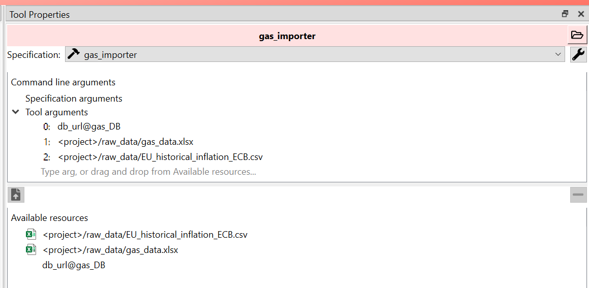

    * Set the source directory and enable full purge options in the connection properties, following the same procedure as the Industrial Sector pipeline. 

### 4. Commodities 💲

* In the Spine DB editor, import this [json file](spinefiles/industrypipelinedemo/pipelines/_commodities/commodities_template_DB.json) which includes the commodity data and DB structure.

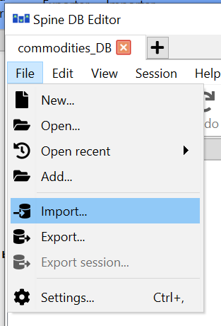


Once you create the pipelines, this is how the workflow looks:

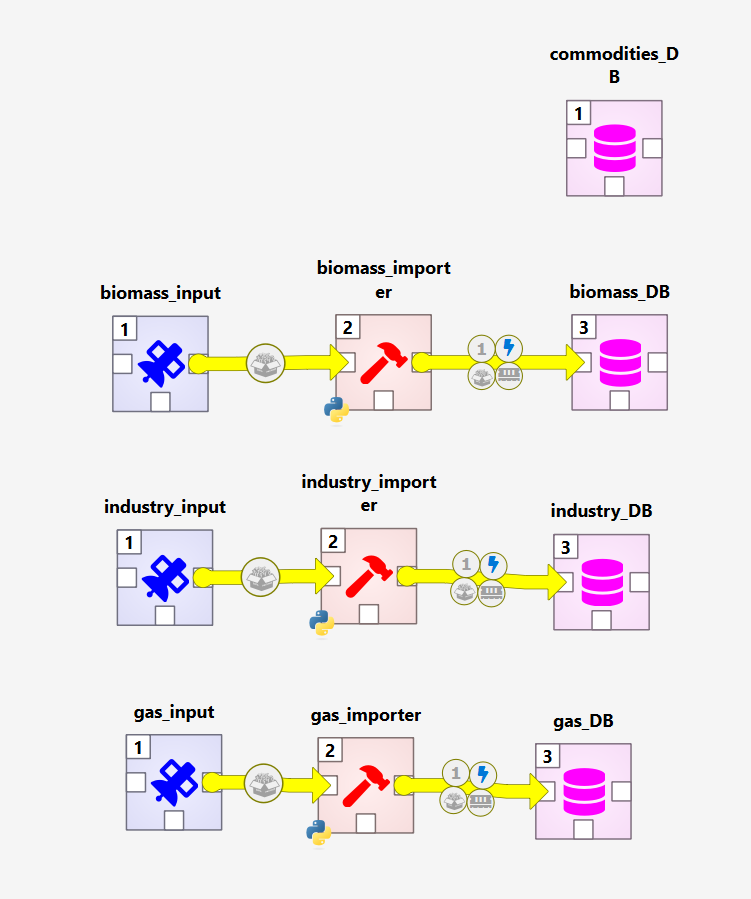

---

## 🔗 INES Pipeline

The next step in this workflow is to consolidate all pipelines into a single database that represents the model for this case study. This model is implemented using the [INES](https://github.com/ines-tools/ines-spec/) format, which stands for **Interoperable Energy System Specification**. INES defines a standardized data format for exchanging energy system models, aiming to facilitate interoperability between different energy modeling tools and platforms.


To achieve this, you need to create the following components:

1. A Python tool using the script located at `pipelines/_ines-builder/ines_target.py`.
2. A data connector pointing to the [`user configuration file`](spinefiles/industrypipelinedemo/userconfig.yaml), which defines the model to be analyzed.
3. A SQLite database that will be populated by the tool using the INES format.

Once these components are created, connect the four previous pipelines to the tool. Ensure the arguments are passed in the correct order, as shown in the image below:

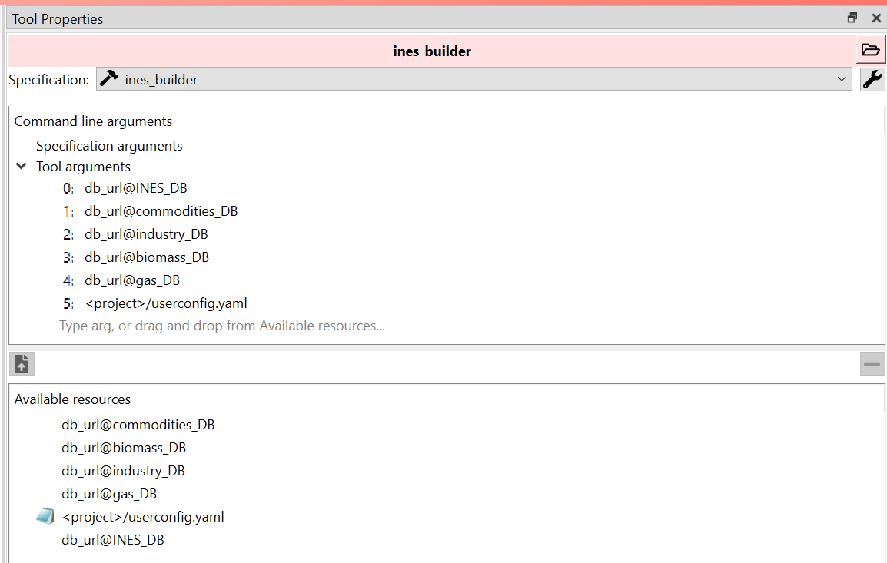

Next, set the source directory and enable the **full purge** options in the connection properties, following the same procedure used for the source database pipelines.

At this point, your workflow should resemble the following

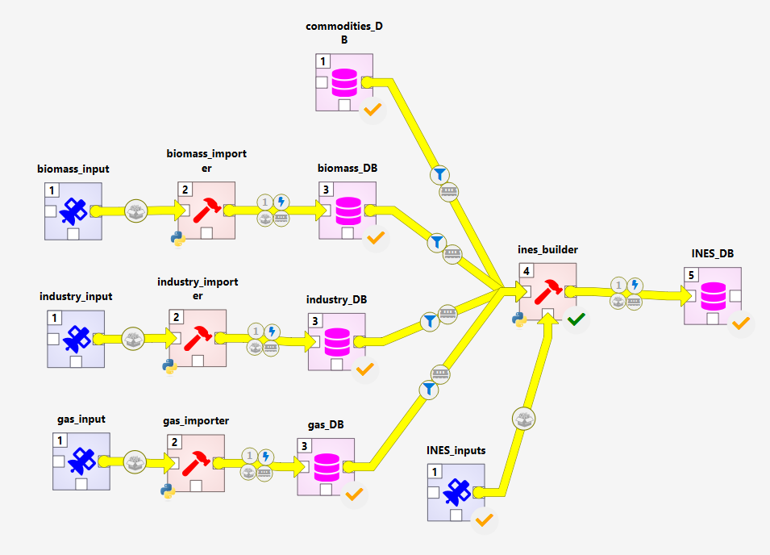

---

## 🔗 INES to SpineOpt

After building the INES model, the next step is to connect it to an energy system optimization tool. In this case, we use [SpineOpt](https://github.com/spine-tools/SpineOpt.jl) (which is also installed with the install inestools script).

To proceed:

1. Clone the transformer tool [`ines_to_spineopt`](https://github.com/ines-tools/ines-spineopt) into your project folder:

   ```bash
   git clone https://github.com/ines-tools/ines-spineopt
   ```

2. Add new items to the workflow to integrate the transformer. Specifically, create a Python tool that connects the INES database to a SpineOpt database. The main script is __ines_to_spineopt.py__, which takes two arguments:

    * The INES database (input)
    * The SpineOpt database (output)

As with previous pipelines, set the source directory in the tool properties. In the connection properties for the SpineOpt database, enable purge options for entity, value, and scenario items.

3. Add another tool to load the SpineOpt template into the SpineOpt database. You can find this tool in the item bar under the SpineOpt plugin. This tool should also connect to the SpineOpt DB and take it as its argument.

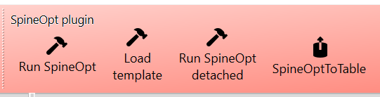

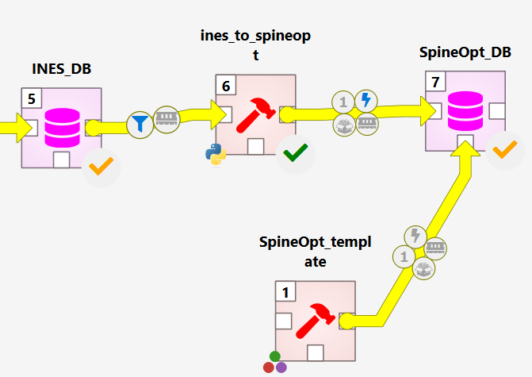

Before running the transformer, install the [INES tools](https://github.com/ines-tools/ines-tools), which provide utility functions for processing INES specifications. Clone the repository into the same folder as your Spine tools and activate the environment where Spine Toolbox is running (which is already done by the install inestools script):

```
git clone https://github.com/ines-tools/ines-tools
cd ines-tools
pip install .
```

Once completed, your workflow should look like this, and you’ll be ready to build your SpineOpt model:

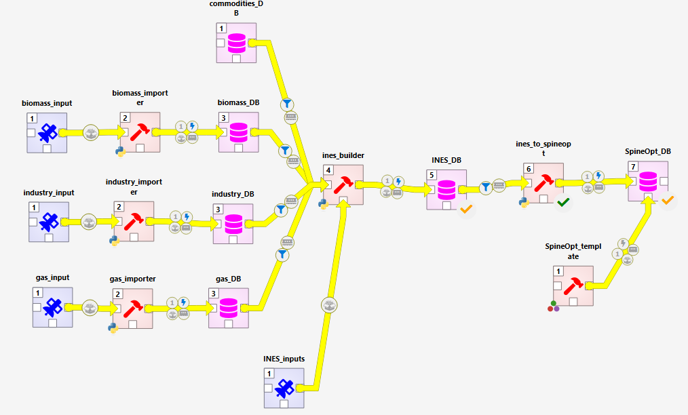

---

## 🔧 SpineOpt Setup

Now, to optimize the model, connect the SpineOpt database to the `Run SpineOpt` tool, which can be found in the item bar under the SpineOpt plugin. Then, add an output database and link it to this tool to store the optimization results. The tool requires two arguments: first, the SpineOpt database, and second, the output database.

In the [secondary_files folder](/secondary_files/), you will find the script `planning_setup.py`. As the next step, create a tool using this script and connect to the SpineOpt DB — **do not enable purge options** for this tool and add SpineOpt DB as an argument. It serves as a complementary component to the model and is specifically designed for scenario analysis, which is why it should be executed downstream in the workflow.

This tool performs the following tasks:

* Updates investment costs to reflect annualized values.
* Updates investment costs by incorporating fixed operation and maintenance (O&M) costs.
* Generates the scenarios to be analyzed.
* Adjusts the temporal resolution to simulate a single hour, based on the assumption that demand profiles in the industrial sector are flat.

Once implemented, your workflow should look like this:

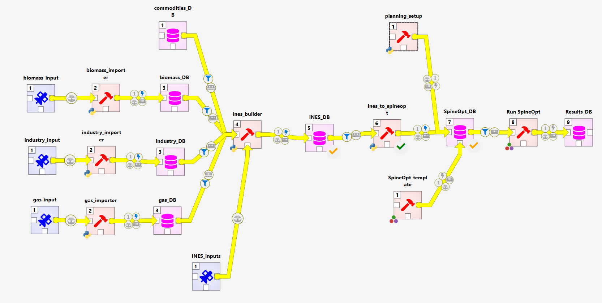

---

## 🚀 Run SpineOpt

1. Run SpineOpt_template tool (only the first time)
2. Run ines_to_spineopt tool
3. Run planning_setup tool
4. Rerun SpineOpt_template tool as the output has been clean when executed ines_to_spineopt tool, and these entities are needed to display the results after running SpineOpt.
5. In the link properties from SpineOpt DB to the tool `Run SpineOpt`, filter out all the scenarios except for __y2030__ as we will start running the milestone year 2030 and using it as starting point for 2040.
6. Execute SpineOpt

---

## ⏮ Model Update from Results

Once the optimization for **2030** is complete, the next step is to update the SpineOpt model to incorporate the optimized infrastructure as the baseline for **2040**. The same procedure applies when transitioning from **2040** to **2050**.

To implement this, create a new tool using the script `planning_feedback.py`. This tool requires two arguments:
1. The SpineOpt database (input)
2. The Results database (output)

This workflow should look as follows:

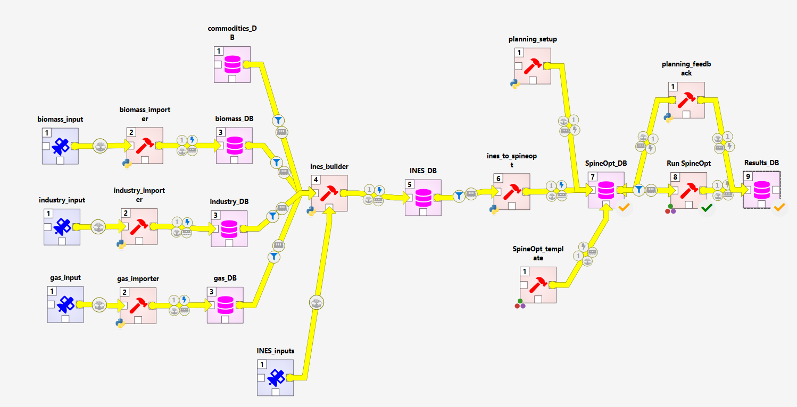

After creating the tool, follow these steps:

1. Run the `planning_feedback.py` tool to update the SpineOpt database with the results from the previous milestone.
2. Modify the properties of the link connecting the SpineOpt DB to the `Run SpineOpt` tool to **filter out all scenarios except `y2040`**.
3. Execute the `Run SpineOpt` tool again to solve for 2040.
4. Repeat the same process to solve for **2050**, using the updated model from 2040 as the new baseline.

This rolling update ensures that each milestone year builds upon the infrastructure decisions made in the previous one.

---

## 📊 Visualization

Finally, once the results are available, we will add a visualization tool to analyze key outputs such as:
- Commodities consumed by each sector
- Emissions generated
- CO₂ usage as a commodity across different processes

To do this, create a tool using the script `visualization.py`. This tool requires the **Results database** as its argument. Make sure to set the **source directory** in the tool properties.

The workflow should now look like this:

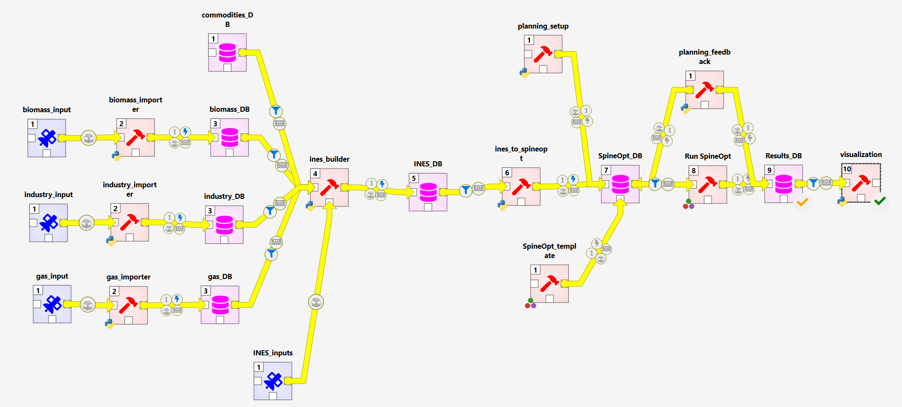

**Run the tool** and the resulting plots will be saved in the [results folder](/secondary_files/results/).

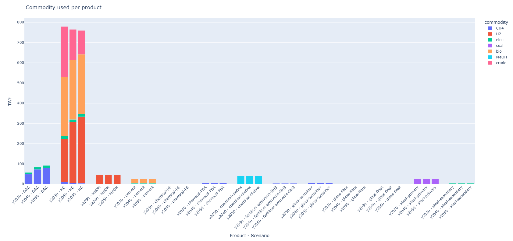

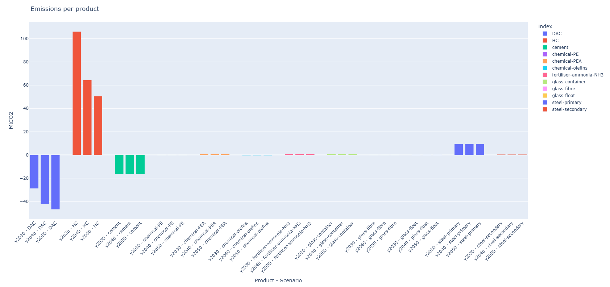

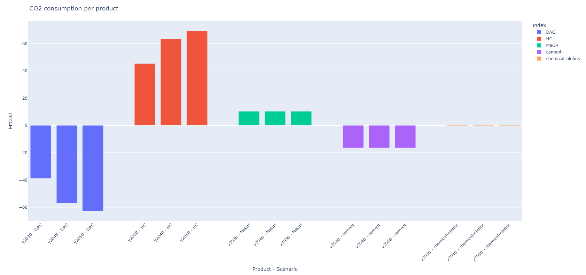

---

# 👨🏽‍💻 Contributors 

**Alvaro Porras**, aporras@epri.com, Researcher, EPRI Europe

---

# 🌞 Acknowledgements 

<center>
<table width=500px frame="none">
<tr>
<td valign="middle" width=100px>
</td>
<td valign="middle">This work has been partially supported by EU project Mopo (2023-2026), which has received funding from European Climate, Infrastructure and Environment Executive Agency under the European Union’s HORIZON Research and Innovation Actions under grant agreement N°101095998.</td>
</table>
</center>


